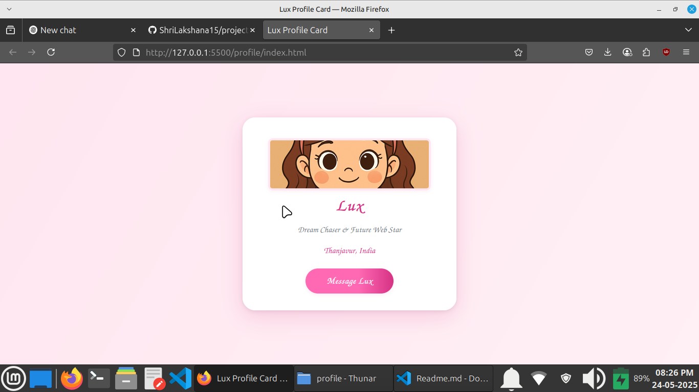

# Lux Profile Card

A modern, responsive profile card web page built with HTML and CSS.  
Showcases a personal profile with a photo, location, and social media link.

## Features

- Clean, modern design
- Responsive layout for mobile and desktop
- Profile image, name, title, location, and Instagram contact button
- Accessible and semantic HTML

## Demo



## Getting Started

1. **Clone this repository:**
   ```bash
   git clone https://github.com/your-username/lux-profile-card.git
   cd lux-profile-card/profile
   ```

2. **Add your profile image:**
   - Place your image in the `profile` folder and name it `profile_pic.png`.

3. **Open in browser:**
   - Open `index.html` in your web browser.

## File Structure

```
profile/
├── index.html
├── styles.css
└── profile_pic.png
```

## Customization

- **Change profile details:**  
  Edit `index.html` to update the name, title, location, and social links.
- **Update styles:**  
  Modify `styles.css` for custom colors, fonts, or layout.

## License

This project is open source and available under the [MIT License](LICENSE).

---

*Made with ❤️ by Lux*